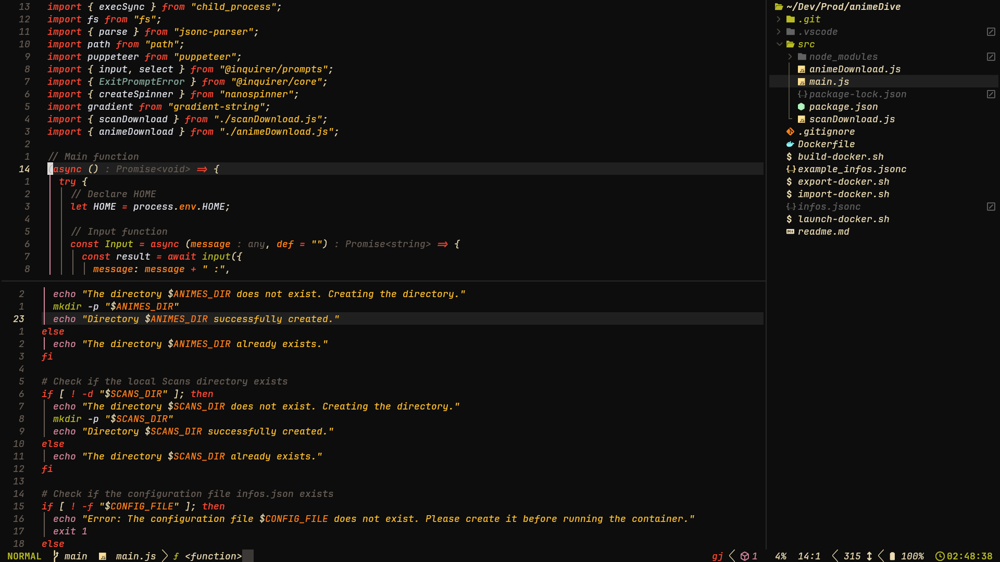

# Tokyogruv.nvim



### About

A harmonious blend of [Gruvbox](https://github.com/morhetz/gruvbox) and [Tokyodark](https://github.com/tiagovla/tokyodark.nvim), delivering a rich dark theme for Neovim (0.7.2+). Written in Lua, this theme combines Gruvbox's earthy warmth with Tokyodark's modern contrast for a unique visual experience.

### Features

- Seamless integration with popular plugins
- Customizable syntax styles and palette
- Adjustable brightness and transparency
- Terminal color support

### Installation

Install via [lazy.nvim](https://github.com/folke/lazy.nvim):

```lua
{
    "BnSplits/tokyogruv.nvim",
    opts = {
        -- Your custom options here
    },
    config = function(_, opts)
        require("tokyogruv").setup(opts) -- Setup is optional
        vim.cmd [[colorscheme tokyogruv]]
    end,
}
```

### Configuration

Default settings with customization options:

```lua
local default_config = {
    transparent_background = false, -- Transparent background
    gamma = 1.00, -- Brightness adjustment (0.8-1.2 recommended)
    styles = {
        comments = { italic = true }, -- Comment style
        keywords = { italic = true }, -- Keyword style
        identifiers = { italic = true }, -- Identifier style
        functions = {}, -- Function style
        variables = {}, -- Variable style
    },
    custom_highlights = {}, -- Extend highlights: table or function(highlights, palette)
    custom_palette = {}, -- Extend palette: table or function(palette)
    terminal_colors = true, -- Sync with terminal colors (requires Neovim 0.8+)
}
```

### Inspiration & Credits

This theme stands on the shoulders of giants:
- [Gruvbox](https://github.com/morhetz/gruvbox) - Base color philosophy
- [Tokyodark.nvim](https://github.com/tiagovla/tokyodark.nvim) - Modern structure and implementation
- [Tokyo Night Ecosystem](https://github.com/enkia/tokyo-night-vscode-theme) - Initial configuration approach
